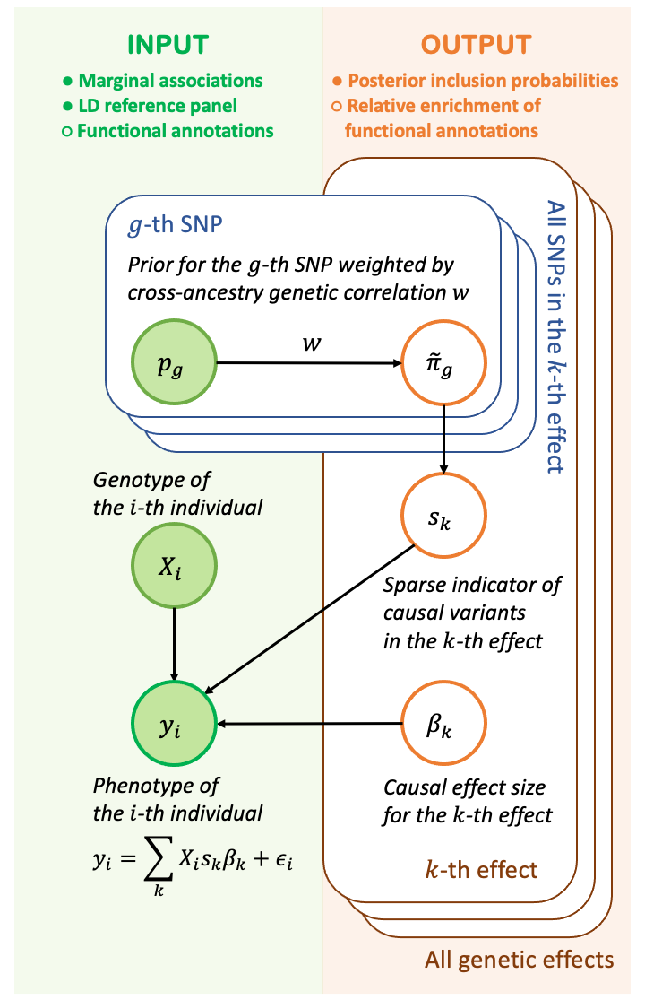

# SparsePro for efficient genome-wide fine-mapping with summary statistics and functional annotations

Identifying causal variants from genome-wide association studies (GWASs) is challenging due to widespread linkage disequilibrium (LD). Functional annotations of the genome may help prioritize variants that are biologically relevant and thus improve fine-mapping of GWAS results.

Here, we have developed SparsePro to efficiently conduct functionally informed fine-mapping. Our method has two key features: First, by creating a sparse low-dimensional projection of the high-dimensional genotype, we enable a linear search of causal variants instead of an exponential search of causal configurations in most existing methods; Second, we adopt a probabilistic framework with a highly efficient variational expectation-maximization algorithm to integrate statistical associations and functional priors.

Full description is available at our [preprint paper](https://www.biorxiv.org/content/10.1101/2021.10.04.463133v1). 


## Table of Contents

- [SparsePro for efficient genome-wide fine-mapping with summary statistics and functional annotations](#sparsepro-for-efficient-genome-wide-fine-mapping-with-summary-statistics-and-functional-annotations)
  * [Overview](#overview)
  * [Installation](#installation)
  * [Usage](#usage)
    + [SparsePro-: statistical finemapping with summary statistics](#sparsepro---statistical-finemapping-with-summary-statistics)
    + [Enrich: testing function enrichment of annotations](#enrich--testing-function-enrichment-of-annotations)
    + [SparsePro+: annotated finemapping with summary statistics and functional annotations](#sparsepro---annotated-finemapping-with-summary-statistics-and-functional-annotations)
  * [License](#license)

## Overview 


Identifying causal variants from genome-wide association studies (GWASs) is challenging due to widespread linkage disequilibrium (LD). Functional annotations of the genome may help prioritize variants that are biologically relevant and thus improve fine-mapping of GWAS results.
To fine-map causal SNPs, our method takes two lines of evidence. First, from estimated marginal associations between genetic variants and a complex trait of interest, accompanied by matched LD information, we can group correlated genetic variants together and assess their effects jointly. Then we infer the contribution of each SNP towards each group of causal effect separately to obtain posterior inclusion probabilities (PIPs). Second, optionally, if we have knowledge about any functional annotations which may be enriched for the causal SNPs, we can estimate the relative enrichment of these annotations, and prioritize SNPs with these annotations so that they are more likely to be considered causal variants. As outputs, our model yields functionally informed PIP for each SNP and the enrichment estimates of candidate functional annotations.

## Installation

SparsePro is tested under Python 3.9.7 and requires the following Python packages:

* [numpy](http://www.numpy.org/) (version==1.21.3)
* [scipy](http://www.scipy.org/) (version==1.7.1)
* [pandas](https://pandas.pydata.org/getpandas.html) (version==1.3.4)

To install SparsePro:

```
git clone https://github.com/zhwm/Sparse_Pro.git
cd Sparse_Pro
pip install -r requirements.txt 
``` 

## Input files

## Usage

### SparsePro-: statistical finemapping with summary statistics

```python
python src/sparsepro.py \
    --ss dat/22.ss \
    --var_Y 1.0 \
    --N 283677 \ 
    --LDdir dat/LD \
    --LDlst dat/22.lst \
    --save dat/res \
    --prefix 22 \
    --tmp True \
    --K 9 
```

### Enrich: testing function enrichment of annotations

```python
python src/enrich.py \
    --save dat/res \
    --prefix 22 \
    --anno dat/22.anno \
    --pip dat/res/22.pip \
    --pthres 0.5
```

### SparsePro+: annotated finemapping with summary statistics and functional annotations 

```python
python src/sparsepro_plus.py \
    --ss dat/22.ss \
    --var_Y 1.0 \ 
    --N 283677 \
    --LDdir dat/LD \
    --LDlst dat/22.lst \
    --save dat/res \
    --prefix 22 \ 
    --K 9 \
    --anno dat/22.anno \
    --W dat/res/22.W0.5 
```
## Output files

## FAQ

1. How to obtain trait variance for --var_Y from summary statistics?

   - If the trait has been standardized to have unit variance prior to perfrom GWAS (for example, inverse normal transformed), we can set it as 1.0. Otherwise, it can be estimated from `var_Y = 2Np(1-p)se^2`  where `N` (the sample size), `p` (minor allele frequencies), and `se` (standard errors of effect size estimates) are usually available in GWAS summary statistics.

2. How to set hyperparameter K?

   - We have shown that SparsePro is not sensitive to the setting of K as long as K is larger than the actual number of effects, except that increasing K marginally increases the computation time. A practical guide would be making sure the number of identified effect is always smaller than K.   

## License

This project is licensed under the MIT License.

## Authors

- Wenmin Zhang (wenmin.zhang@mail.mcgill.ca)
- Hamed Najafabadi (hamed.najafabadi@mcgill.ca)
- Yue Li (yueli@cs.mcgill.ca)

## Citations

If you use this software, please cite:

[Wenmin Zhang, Hamed Najafabadi, Yue Li. SparsePro: an efficient genome-wide fine-mapping method integrating summary statistics and functional annotations. bioRxiv 2021.10.04.463133](https://doi.org/10.1101/2021.10.04.463133)
