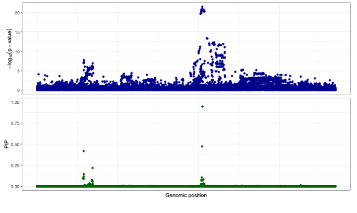

# SparsePro for efficient genome-wide fine-mapping with summary statistics and functional annotations

SparsePro is a command line tool for efficiently conducting genome-wide fine-mapping. Our method has two key features: First, by creating a sparse low-dimensional projection of the high-dimensional genotype, we enable a linear search of causal variants instead of an exponential search of causal configurations in most existing methods; Second, we adopt a probabilistic framework with a highly efficient variational expectation-maximization algorithm to integrate statistical associations and functional priors.

Full description is available in our [preprint paper](https://www.biorxiv.org/content/10.1101/2021.10.04.463133v1). 

## Table of Contents

- [Overview](#overview)
- [Installation](#installation)
- [Input files](#input-files)
- [Usage](#usage)
  * [SparsePro-: statistical fine-mapping with summary statistics](#sparsepro---statistical-fine-mapping-with-summary-statistics)
  * [Enrich: testing function enrichment of annotations](#enrich--testing-function-enrichment-of-annotations)
  * [SparsePro+: annotated fine-mapping with summary statistics and functional annotations](#sparsepro---annotated-fine-mapping-with-summary-statistics-and-functional-annotations)
- [Output files](#output-files)
- [FAQ](#faq)
- [License](#license)
- [Authors](#authors)
- [Citations](#citations)

## Overview 


Identifying causal variants from genome-wide association studies (GWASs) is challenging due to widespread linkage disequilibrium (LD). Functional annotations of the genome may help prioritize variants that are biologically relevant and thus improve fine-mapping of GWAS results.

To fine-map causal SNPs, our method takes two lines of evidence. First, from estimated marginal associations between genetic variants and a complex trait of interest, accompanied by matched LD information, we can group correlated genetic variants together and assess their effects jointly. Then we infer the contribution of each SNP towards each group of causal effect separately to obtain posterior inclusion probabilities (PIPs). Second, optionally, if we have knowledge about any functional annotations which may be enriched for the causal SNPs, we can estimate the relative enrichment of these annotations, and prioritize SNPs with these annotations so that they are more likely to be considered causal variants. SparsePro yields functionally informed PIP for each SNP and the enrichment estimates of candidate functional annotations.

## Installation

SparsePro was developed under Python 3.9.7 environment but should be compatible with older versions of Python 3. The following Python modules are required:

* [numpy](http://www.numpy.org/) (version==1.21.3)
* [scipy](http://www.scipy.org/) (version==1.7.1)
* [pandas](https://pandas.pydata.org/getpandas.html) (version==1.3.4)

To install SparsePro:

```
git clone https://github.com/zhwm/Sparse_Pro.git
cd Sparse_Pro
pip install -r requirements.txt 
``` 

To test the installation and display basic usage:

```
$> python src/sparsepro.py -h
usage: sparsepro.py [-h] --ss SS --var_Y VAR_Y --N N --LDdir LDDIR --LDlst LDLST --save SAVE --prefix PREFIX
                    [--verbose VERBOSE] [--tmp TMP] --K K

SparsePro- Commands:

optional arguments:
  -h, --help         show this help message and exit
  --ss SS            path to summary stats
  --var_Y VAR_Y      GWAS trait variance
  --N N              GWAS sample size
  --LDdir LDDIR      path to LD files
  --LDlst LDLST      path to LD list
  --save SAVE        path to save result
  --prefix PREFIX    prefix for result files
  --verbose VERBOSE  options for displaying more information
  --tmp TMP          options for saving intermediate file
  --K K              largest number of effect
```


```
$> python src/enrich.py -h   
usage: enrich.py [-h] --save SAVE --prefix PREFIX --anno ANNO --pip PIP --pthres PTHRES

SparsePro Enrich Commands:

optional arguments:
  -h, --help       show this help message and exit
  --save SAVE      path to save result
  --prefix PREFIX  prefix for result files
  --anno ANNO      path to annotation file
  --pip PIP        path to pip file
  --pthres PTHRES  p value threshold for enrichment
```

```
$> python src/sparsepro_plus.py -h
usage: sparsepro_plus.py [-h] --ss SS --var_Y VAR_Y --N N --LDdir LDDIR --LDlst LDLST --save SAVE --prefix
                         PREFIX [--verbose VERBOSE] --K K [--anno ANNO] --W W

SparsePro+ Commands:

optional arguments:
  -h, --help         show this help message and exit
  --ss SS            path to summary stats
  --var_Y VAR_Y      GWAS trait variance
  --N N              GWAS sample size
  --LDdir LDDIR      path to LD files
  --LDlst LDLST      path to LD list
  --save SAVE        path to save result
  --prefix PREFIX    prefix for result files
  --verbose VERBOSE  options for displaying more information
  --K K              largest number of effect
  --anno ANNO        path to annotation file
  --W W              path to enriched file
```

## Input files

Example input files are included in the [dat](dat/) directory.

SparsePro takes in the following files: 

1. **summmary statistics file** that contains SNP ('CHR.POS.A1.A2'; must match the IDs used in LD file(s)), BETA (effect size estimate from GWAS), SE (standard deviation of effect size from GWAS).

```
$> head -5 dat/22.ss

SNP	BETA	SE
22.19500559.G.A	0.00562955	0.0322818
22.19500581.C.A	0.00258343	0.00596305
22.19500657.C.G	0.00298233	0.00267837
22.19500832.T.C	0.0161714	0.0101509 
```

2. **LD file(s)** that contains SNP-SNP correlations. The indices should match the summary statistics file.   

```
$> head -5 dat/chr22_19500001_21000001.ld | cut -f 1-5
SNP	22.19500559.G.A	22.19500581.C.A	22.19500657.C.G	22.19500832.T.C
22.19500559.G.A	1.0	-0.0169	-0.063	-0.0102
22.19500581.C.A	-0.0169	1.0	-0.2274	-0.0317
22.19500657.C.G	-0.063	-0.2274	1.0	-0.1293
22.19500832.T.C	-0.0102	-0.0317	-0.1293	1.0
```

3. **list of LD file(s)** contains a list of LD file(s). These LD files should cover all SNPs in the summary statistics file.

```
$> cat dat/22.lst 
chr22_19500001_21000001.ld.gz
chr22_20000001_21500001.ld.gz
chr22_20500001_22000001.ld.gz
```
4. (optional) **annotation file** with binary entries indicating whether SNPs have the corresponding annotations. 

```
$> head -5 dat/22.anno | cut -f 1-5
SNP	Conserved_LindbladToh	DHS_Trynka	H3K27ac_Hnisz	H3K4me3_Trynka
22.19500559.G.A	0	0	1	0
22.19500581.C.A	0	0	1	0
22.19500657.C.G	0	0	1	0
22.19500832.T.C	0	1	1	0
```

## Usage

Here we use a part of FEV1/FVC ratio GWAS summary statistics calculated using UK Biobank European ancestry participants to showcase genome-wide fine-mapping procedures with SparsePro. All files are included in the [dat](dat/) directory.

### SparsePro-: statistical fine-mapping with summary statistics

We use [sparsepro.py](src/) to perform statistical fine-mapping. We can provide the summary statistic file, LD file, and LD list file through --ss, --LDdir, and --LDlst, respectively. 

To help setting hyperparameters, GWAS sample size `N` is set as 283677 and trait variance `var_Y` is provided as 1.0 since we performed inverse normal transformation before GWAS. We also set the largest number of effect `K` to be 9.

Also, we use --save to specify the path for saving results and --prefix 22 to specify the prefix for result files.

If you intend to perform annotated fine-mapping, please set `--tmp True`, to store intermediate files (with suffix .obj) to save computation time.

We suggest separating the whole genome into chromosomal chunks to perform parallel statistical fine-mapping. 

```python
python src/sparsepro.py \
    --ss dat/22.ss \
    --var_Y 1.0 \
    --N 283677 \
    --LDdir dat/LD \
    --LDlst dat/22.lst \
    --save dat/res \
    --prefix 22 \
    --tmp True \
    --K 9
```

Here is the expected output:

```
summary statistics loaded at 2021-10-28 15:59
LD list with 3 LD blocks loaded

6134 variants loaded from chr22_19500001_21000001.ld.gz with 6134 variants having matched summary statistics explaining 0.21% of trait heritability 

Altogether 5 effect(s) detected.
In the 0-th effect:
causal variants: ['22.20778066.A.G', '22.20776406.A.G']
posterior inclusion probabilities: [0.5054, 0.102]

In the 1-th effect:
causal variants: ['22.19753449.A.G', '22.19754091.A.C', '22.19753848.A.G']
posterior inclusion probabilities: [0.4296, 0.1427, 0.1144]

In the 2-th effect:
causal variants: ['22.20780296.G.A']
posterior inclusion probabilities: [0.9883]

In the 3-th effect:
causal variants: ['22.19803382.C.A']
posterior inclusion probabilities: [0.2201]

In the 4-th effect:
causal variants: ['22.19508232.A.G']
posterior inclusion probabilities: [0.1423]

5804 variants loaded from chr22_20000001_21500001.ld.gz with 5804 variants having matched summary statistics explaining 0.18% of trait heritability 

Altogether 2 effect(s) detected.
In the 0-th effect:
causal variants: ['22.20778066.A.G', '22.20776406.A.G']
posterior inclusion probabilities: [0.5044, 0.1012]

In the 1-th effect:
causal variants: ['22.20780296.G.A']
posterior inclusion probabilities: [0.9923]

4561 variants loaded from chr22_20500001_22000001.ld.gz with 4561 variants having matched summary statistics explaining 0.16% of trait heritability 

Altogether 2 effect(s) detected.
In the 0-th effect:
causal variants: ['22.20778066.A.G', '22.20776406.A.G']
posterior inclusion probabilities: [0.5108, 0.1005]

In the 1-th effect:
causal variants: ['22.20780296.G.A']
posterior inclusion probabilities: [0.9956]

Statistical fine-mapping finished at 2021-10-28 16:00. Writing all PIPs to 22.pip ...
```

### Enrich: testing function enrichment of annotations

After obtaining PIPs from statistical fine-mapping, we can test for functional enrichment of annotations with [enrich.py](src/).

We use --anno to provide the annotation file and --pip to provide statistical fine-mapping PIPs. To increase statistical power of functional annotations, we suggest aggregating whole genome SNPs to perform the testing. 

We use the p-value cutoff supplied to --pthres to select significantly enriched annotations for updating priors in annotated fine-mapping. Here we use 0.5 only to showcase the utility. We recommend setting the threshold to **1e-6** if genome-wide SNPs were included.

```python
python src/enrich.py \
    --save dat/res \
    --prefix 22 \
    --anno dat/22.anno \
    --pip dat/res/22.pip \
    --pthres 0.5
```

Here is the expected output:

```
Annotation file Loaded at 2021-10-28 16:01
There are 9230 variants with 10 annotations and among them 9230 variants have PIP esitmates

Univariate testing finished at 2021-10-28 16:01. Saving result to 22.wsep file...

4 annotations are deemed significantly enriched at 0.5 p-value threshold and used to update priors. Saving result to 22.W0.5 file...
```

### SparsePro+: annotated fine-mapping with summary statistics and functional annotations 

We use [sparsepro_plus.py](src/) to perform annotated fine-mapping. Given the relative enrichment estimates, we can update the prior probability of being causal for each variants with their annotations.

Please use the same `K`, `N` and `var_Y` for both statistical fine-mapping and annotated fine-mapping. 

```python
python src/sparsepro_plus.py \
    --ss dat/22.ss \
    --var_Y 1.0 \
    --N 283677 \
    --LDdir dat/LD \
    --LDlst dat/22.lst \
    --save dat/res \
    --prefix 22 \
    --K 9 \
    --anno dat/22.anno \
    --W dat/res/22.W0.5 
```

Here is the expected output:

```
summary statistics loaded at 2021-10-28 16:02
Annotation file Loaded at 2021-10-28 16:02
There are 9230 variants with 10 annotations and among them 9230 variants have summary statistics

LD list with 3 LD blocks loaded

6134 variants loaded from chr22_19500001_21000001.ld.gz with 6134 variants having matched summary statistics explaining 0.21% of trait heritability 

Altogether 5 effect(s) detected.
In the 0-th effect:
causal variants: ['22.20785639.G.A', '22.20778066.A.G']
posterior inclusion probabilities: [0.8021, 0.1339]

In the 1-th effect:
causal variants: ['22.19754091.A.C', '22.19753449.A.G']
posterior inclusion probabilities: [0.7088, 0.1476]

In the 2-th effect:
causal variants: ['22.20780296.G.A']
posterior inclusion probabilities: [0.9997]

In the 3-th effect:
causal variants: ['22.19798836.C.G', '22.19803382.C.A']
posterior inclusion probabilities: [0.1246, 0.11]

In the 4-th effect:
causal variants: ['22.20101289.C.T']
posterior inclusion probabilities: [0.2285]

5804 variants loaded from chr22_20000001_21500001.ld.gz with 5804 variants having matched summary statistics explaining 0.18% of trait heritability 

Altogether 2 effect(s) detected.
In the 0-th effect:
causal variants: ['22.20785639.G.A', '22.20778066.A.G']
posterior inclusion probabilities: [0.806, 0.1242]
```

So far, we have finished fine-mapping our subset of the FEV1/FFR GWAS summary statistics. Due to the small number of variants investigated, we do not find any evidence of functional enrichment. We can visualize the statistical fine-mapping PIPs and compare with the p-values obtained in GWAS.



## Output files

If no functional annotation is provided, we have the following output file saved to the path specified by --save:

1. statistical fine-mapping PIPs

```
$> head -5 22.pip
22.19500559.G.A	0.0
22.19500581.C.A	0.0
22.19500657.C.G	0.0
22.19500832.T.C	0.0
22.19500918.T.C	0.0
```

Given functional annotations, we have the following additional output files saved to the path specified by --save:

1. annotated fine-mapping PIPs

```
$> head -5 22.apip
22.19500559.G.A 0.0
22.19500581.C.A 0.0
22.19500657.C.G 0.0
22.19500832.T.C 0.0
22.19500918.T.C 0.0
```

2. univariate test results of functional enrichment for annotations. The first column is the relative enrichment estimates; the second column is standard deviations of relative enrichment estimates and the third column is the p-value of annotation enrichment.

```
$> head -5 22.wsep
	W	se	p
Conserved_LindbladToh	2.209	0.9482	0.2054
DHS_Trynka	1.1631	0.8289	0.3641
H3K27ac_Hnisz	1.0237	1.1261	0.5961
H3K4me3_Trynka	1.1811	0.8362	0.319
```

3. joint relative enrichment estimation of significantly enriched annotations (at the p-value cutoff supplied to --pthres). The first column contains significantly enriched annotations; the second and the third columns contain joint estimates of relative enrichement and their standard deviations. The fourth column contains the column index of these annotations in the original annotation file (0-based).

```
>$ head 22.W0.5 
ANNO	W_sig	W_se_sig	sigidx
Conserved_LindbladToh	0.9702117252665534	0.9492466421964948	0
DHS_Trynka	0.9431559764601944	0.8289476027010576	1
H3K4me3_Trynka	0.619519677762428	0.8362184062338268	3
non_synonymous	2.640968734588369	1.0019843330387552	8
```


## FAQ

1. How do we obtain trait variance for --var_Y from summary statistics?

   - If the trait has been standardized to have unit variance prior to performing GWAS (for example, inverse normal transformed), we can set it as 1.0. Otherwise, it can be estimated from `var_Y = 2Np(1-p)se^2`  where `N` (the sample size), `p` (minor allele frequencies), and `se` (standard errors of effect size estimates) are usually available in GWAS summary statistics. If the `var_Y` estimates vary across variants, we supply the median value of all these estimates.

2. How do we set hyperparameter K?

   - We have shown that SparsePro is not sensitive to the setting of K as long as K is larger than the actual number of causal effects, except that increasing K marginally increases the computation time.   

## License

This project is licensed under the MIT License.

## Authors

- Wenmin Zhang (wenmin.zhang@mail.mcgill.ca)
- Hamed Najafabadi (hamed.najafabadi@mcgill.ca)
- Yue Li (yueli@cs.mcgill.ca)

## Citations

If you use this software, please cite:

[Wenmin Zhang, Hamed Najafabadi, Yue Li. SparsePro: an efficient genome-wide fine-mapping method integrating summary statistics and functional annotations. bioRxiv 2021.10.04.463133](https://doi.org/10.1101/2021.10.04.463133)
